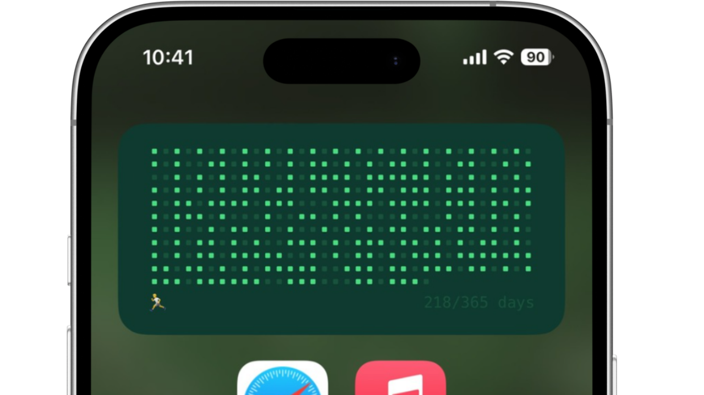

# Strava 러닝 트래커 위젯



270일간의 러닝 기록을 시각적으로 보여주는 [Scriptable](https://scriptable.app) 위젯입니다.
뛴 날에는 초록색 점이 표시되어 러닝 습관을 한눈에 확인할 수 있습니다.

## 준비사항

### 1. Strava 개발자 계정 생성

[Strava Developers](https://developers.strava.com)에서 무료 개발자 계정을 만들어야 합니다.

1. **새 Strava 앱 생성**
2. 모든 필드 입력 (웹사이트는 `https://sampleapp.strava.com` 등 아무거나)
3. **콜백 도메인**을 `developers.strava.com`으로 설정
4. 앱 이미지 업로드 (아무 이미지나 상관없음)

완료하면 **Client ID**와 **Client Secret**을 확인할 수 있습니다.

### 2. 인증 토큰 발급

[이 단축어를 다운로드](https://www.icloud.com/shortcuts/2ef1be09e295402bb4d73949ca909462)하고 **Client ID**와 **Client Secret**을 입력합니다.

*단축어를 처음 사용하는 경우 설정 > 앱 > 단축어 > 고급에서 스크립트 실행을 허용해 주세요.*

#### 진행 과정:
1. **Client ID**와 **Client Secret** 입력
2. Safari에서 Strava 인증 진행
3. 인증 완료 후 빈 페이지가 나타남 (정상 동작)
4. 공유 버튼(↗️) → **복사** 선택
5. **완료** 버튼 누르기
6. 단축어가 필요한 매개변수를 클립보드에 복사

### 3. 위젯 설치

1. **Strava Running Tracker.js** 파일을 Scriptable에 추가
2. 홈화면에 Scriptable 위젯(중간 크기) 추가
3. 위젯을 길게 눌러 **"Scriptable" 편집** 선택
4. **Script**: 방금 만든 Strava Running Tracker 스크립트 선택
5. **Parameter**: 단축어로 만든 매개변수 붙여넣기 (클립보드에 있음)

## 매개변수 형식

```
ClientID|ClientSecret|RefreshToken
```

예시: `12345|abcdef123456|1a2b3c4d5e6f7g8h9i0j`
`12345|abcdef123456|1a2b3c4d5e6f7g8h9i0j|` 형태로 복사되는 경우 마지막의 `|`를 지우고 붙여넣어 주세요.